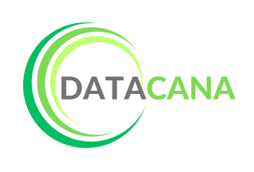

# 🌾 DataCana

<div align="center">
  
  
  **Plataforma Digital para Monitoramento da Cana-de-Açúcar em Minas Gerais**
  
  [](https://www.gnu.org/licenses/gpl-3.0)
  [](https://reactjs.org/)
  [](https://vitejs.dev/)
  [](https://nodejs.org/)
</div>

---

## 📋 Sobre o Projeto

O **DataCana** é um banco de dados digital inovador desenvolvido para disponibilização de informações geradas através do mapeamento do cultivo da cana-de-açúcar em Minas Gerais. A plataforma surge como uma solução moderna para o monitoramento da expansão canavieira através de técnicas avançadas de **geoprocessamento** e produtos de **sensoriamento remoto**.

### 🎯 Objetivos

- **Monitorar** a expansão do cultivo de cana-de-açúcar em Minas Gerais
- **Disponibilizar** dados georreferenciados de forma gratuita e acessível
- **Contribuir** para a divulgação científica e geração de dados
- **Auxiliar** na formulação de políticas públicas para o setor sucroalcooleiro
- **Fornecer** estimativas anuais precisas da produção canavieira

### 🏛️ Instituição e Financiamento

**Universidade Federal de Uberlândia (UFU) - Campus Pontal**
- Instituto de Geografia
- Programa de Pós-Graduação em Geografia do Pontal (PPGEP)

**Financiamento:** Fundação de Amparo à Pesquisa do Estado de Minas Gerais (FAPEMIG)
- Edital Universal - Projeto APQ-01102-22

---

## 🚀 Funcionalidades

### 📊 Visualização de Dados
- **Mapas Interativos** com dados georreferenciados
- **Gráficos Dinâmicos** por mesorregião e microrregião
- **Tabelas Detalhadas** com dados municipais
- **Análises Temporais** (2017, 2018, 2022)

### 🗺️ Plataforma Cartográfica
- Visualização em tempo real dos dados de cultivo
- Controles de escala e legenda interativos
- Sistema de busca geográfica integrado
- Dados estatísticos por município

### 📈 Downloads e Dados Abertos
- Arquivos GeoJSON e CSV disponíveis
- Dados organizados por ano e região
- Formatos compatíveis com SIG

---

## 🛠️ Tecnologias Utilizadas

### Frontend
- **React 19.0.0** - Framework principal
- **Vite 6.2.0** - Build tool e dev server
- **React Router DOM** - Roteamento
- **Chart.js** - Visualização de gráficos
- **Leaflet** - Mapas interativos
- **Papa Parse** - Processamento de CSV
- **Animate.css** - Animações

### Dados e Formatos
- **GeoJSON** - Dados georreferenciados
- **CSV** - Dados tabulares
- **Shapefile** - Dados cartográficos (convertidos)

### Ferramentas de Desenvolvimento
- **ESLint** - Linting de código
- **Node.js** - Ambiente de execução
- **npm** - Gerenciador de pacotes

---

## 📦 Instalação e Execução

### Pré-requisitos
- Node.js (versão mais recente)
- npm ou yarn

### Passos para instalação

1. **Clone o repositório**
   ```bash
   git clone https://github.com/KyKirma/Datacana.git
   cd Datacana
   ```

2. **Navegue para o diretório frontend**
   ```bash
   cd frontend
   ```

3. **Instale as dependências**
   ```bash
   npm install
   ```

4. **Execute o projeto em modo desenvolvimento**
   ```bash
   npm run front
   ```

5. **Acesse a aplicação**
   ```
   http://localhost:5173
   ```

### Scripts Disponíveis

```bash
npm run front    # Inicia o servidor de desenvolvimento
npm run build    # Gera build de produção
npm run preview  # Visualiza o build de produção
npm run lint     # Executa linting do código
```

---

## 📁 Estrutura do Projeto

```
Datacana/
├── frontend/
│   ├── public/
│   │   └── assets/
│   │       ├── datacana/      # Dados de cana-de-açúcar
│   │       ├── external/      # Dados do IBGE
│   │       └── images/        # Recursos visuais
│   ├── src/
│   │   ├── components/        # Componentes reutilizáveis
│   │   ├── pages/            # Páginas da aplicação
│   │   ├── services/         # Serviços de dados
│   │   └── utils/            # Utilitários
│   ├── package.json
│   └── vite.config.js
├── LICENSE
└── README.md
```

---

## 👥 Equipe

### 👩‍🏫 Coordenação
**Prof.ª Dr.ª Jussara dos Santos Rosendo**
- Doutora em Geografia
- Docente UFU - Campus Pontal
- PPGEP - Programa de Pós-Graduação em Geografia do Pontal

### 🗺️ Equipe de Mapeamento
- **Dr.ª Bruna Aparecida Silva Dias** - Doutora em Geografia (PPGEP/UFU)
- **Érik Donis de Melo** - Graduando em Geografia (CNPq)
- **Bruno José Figueiredo Parreira** - Graduando em Geografia (FAPEMIG)
- **Jéssica da Silva Ribeiro** - Graduanda em Geografia (CNPq)
- **Pedro Henrique Santos** - Graduando em Geografia

### 💻 Equipe de Desenvolvimento
- **Gustavo** - Desenvolvedor
- **Pedro** - Desenvolvedor
- **Leandro** - Desenvolvedor

---

## 📊 Dados Disponíveis

### Anos de Cobertura
- **2017** - Dados completos de mapeamento
- **2018** - Dados completos de mapeamento  
- **2022** - Dados completos de mapeamento

### Informações Disponíveis
- Área total cultivada por município
- Códigos IBGE municipais
- Classificação por mesorregião e microrregião
- Coordenadas geográficas precisas
- Dados estatísticos descritivos

---

## 🤝 Contribuições

Contribuições são bem-vindas! Para contribuir:

1. Faça um fork do projeto
2. Crie uma branch para sua feature (`git checkout -b feature/nova-feature`)
3. Commit suas mudanças (`git commit -am 'Adiciona nova feature'`)
4. Push para a branch (`git push origin feature/nova-feature`)
5. Abra um Pull Request

---

## 📄 Licença

Este projeto está licenciado sob a **GNU General Public License v3.0** - veja o arquivo [LICENSE](LICENSE) para detalhes.

---

## 📞 Contato

**Universidade Federal de Uberlândia (UFU)**
- Campus Pontal - Instituto de Geografia
- Ituiutaba, Minas Gerais, Brasil

Para mais informações sobre o projeto, visite nossa [plataforma web](https://datacana.com) ou entre em contato através dos canais oficiais da UFU.

---

<div align="center">
  <p>Desenvolvido com ❤️ pela equipe DataCana</p>
  <p>
    
    
  </p>
</div>